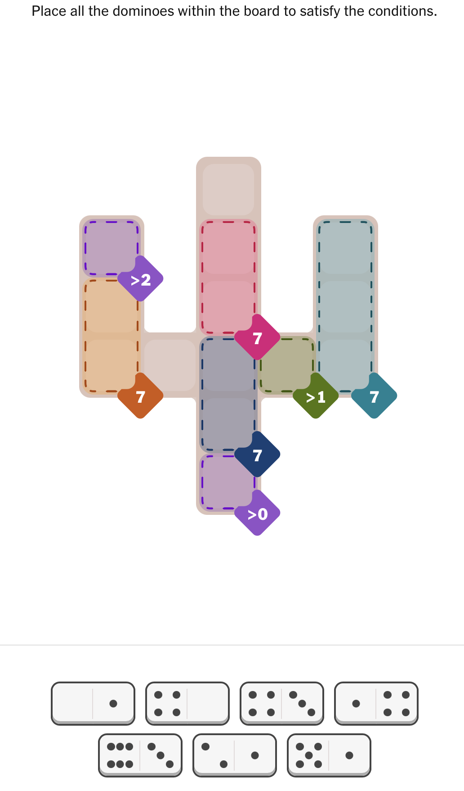
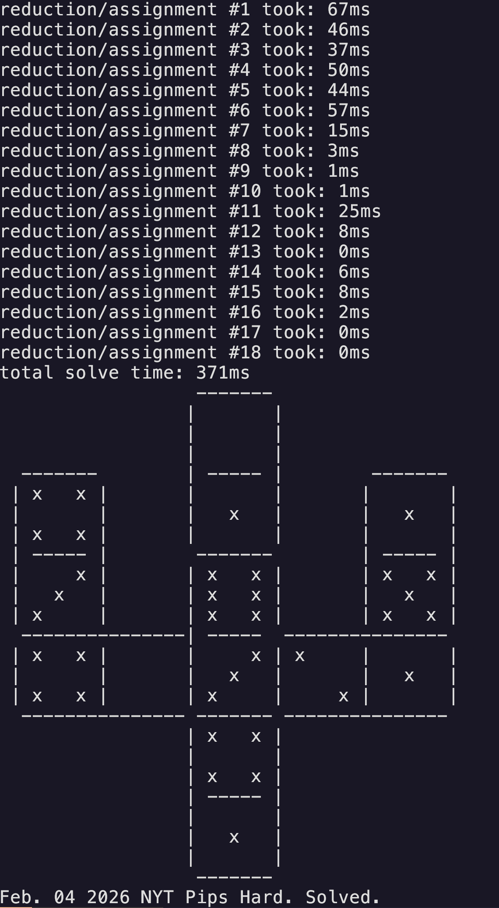

# NYT Pips Solver

A high-performance constraint satisfaction solver for the New York Times domino tiling puzzle, Pips.



## Overview

Pips is a challenging combinatorial puzzle where you must tile an irregular grid with dominoes (2x1 tiles) while satisfying the puzzle's constraints. Each puzzle presents a unique shape carved out of a larger grid, as well as constraining the values that some tiles can hold. and the goal is to find a valid tiling that covers every square exactly once and breaks no constraints.

This solver tackles this type of NP-hard puzzle by implementing a backtracking CSP (Constraint Satisfaction Problem) algorithm with two key optimizations:
- **Generalized Arc Consistency (GAC)**: Aggressively prunes the search space by propagating constraints
- **Minimum Remaining Values (MRV)**: Intelligently orders variable selection to fail fast on impossible branches

## Performance

The solver navigates a massive search space that can get as large as **~10<sup>22</sup> possible configurations** and consistently finds solutions to hard-difficulty NYT Pips puzzles in **under 1 second** (typically ~900ms).

## How It Works

1. **Problem Representation**: Models the puzzle as a CSP where each square is a variable that must be assigned a domino half
2. **Constraint Propagation**: Uses GAC to eliminate impossible domino placements before searching any branch
3. **Smart Branching**: Applies MRV heuristic to choose the most constrained square first
4. **Backtracking**: Explores the pruned search space systematically until a solution is found

## Pre-Build
I haven't yet implemented a pipeline to run arbitrary state, since that was not my focus. The PipsSolver and PipsState objects must be instantiated manually. Additionally, PipsState and PipsSolver both use a fixed-size array to represent the grid. So you must pass the size of the grid in the template arguments and have it known at compile time. include/examples has examples of some Pips puzzles being set up, the solver is run in src/main.cpp.

## Building
To build, simply run
```bash
make
```
in the build directory. Or compile manually, as there aren't many pieces to this project.

## Usage
```bash
./pips_solver
```
This will run src/main.cpp, which sets up the state to be solved.

## Output


## Algorithm Details

The solver uses a combination of:
- **Forward checking**: Removes values from future variables after each assignment
- **Generalized Arc Consistency (GAC)**: Ensures that for every value in the domain of a tile, there exist valid values for all other tiles that share a constraint
- **Minimum Remaining Values (MRV) heuristic**: Searches the space in an order that greatly minimizes the search space.
- **Domain minimization**: Ensures the values in each tile don't directly contradict a constraint
- **Intelligent backtracking**: Prunes branches early when contradictions are detected

## Performance Notes

Search space size varies with grid dimensions and shape complexity. For the Dec 21st Hard puzzle with a shape that fits in a 7x7 grid:
- **Theoretical configurations (state space size)**: ~10<sup>22</sup>
- **States actually explored during solve**: 16
- **Pruning ratio**: >99.99% of the search space eliminated
- **Solve time**: 700-1000ms on my laptop
